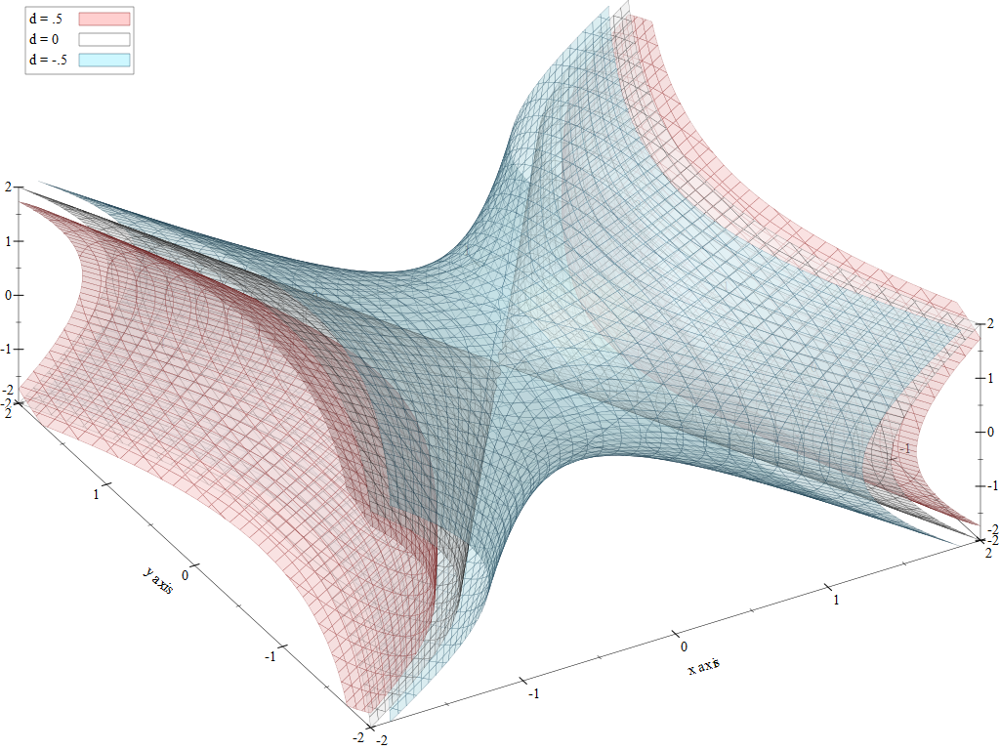

This is the source code for the Racket "plot" package which used to make 2D
and 3D plots. This package is included in the
[Racket](https://racket-lang.org/) installation, so, if you installed Racket,
you can use it straight away.  Open DrRacket and type in the follwing in the
command window:

```racket
(require plot)
(plot (function sin -5 5))
```

## To Get Help

* The [Plot Documentation](https://docs.racket-lang.org/plot/index.html) shows
  how to use the package.
* The [Plot Cookbook](https://github.com/Racket-Cookbooks/Plot-cookbook)
  contains more plot examples.
* The [Racket Discourse](https://racket.discourse.group/) group can be used
  for questions and assistance.
* The [Issue Tracker](https://github.com/racket/plot/issues) can be used for
  reporting bugs or feature requests.

## Contributing

You can contribute to this package by creating a pull request, but we
recommend joining the [Racket Discourse](https://racket.discourse.group/)
group to discuss the features you plan to add or bugs you intend to fix. Other
Racket developers may be able to assist you with advice and providing links to
the relevant pieces of code.

By making a contribution, you are agreeing that your contribution is licensed
under the [Apache 2.0] license and the [MIT] license.

## License

Racket, including these packages, is free software, see [LICENSE] for more
details.

[MIT]: https://github.com/racket/racket/blob/master/racket/src/LICENSE-MIT.txt
[Apache 2.0]: https://www.apache.org/licenses/LICENSE-2.0.txt
[LICENSE]: LICENSE
